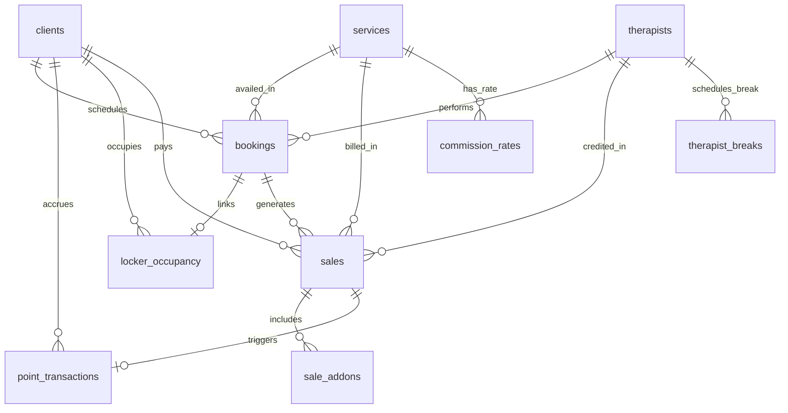
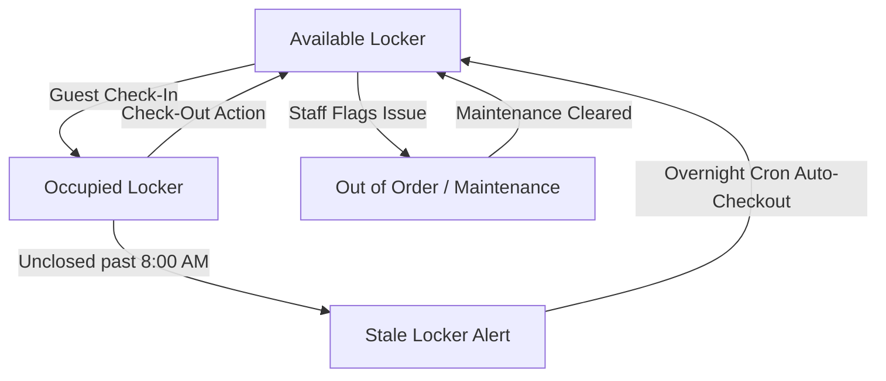
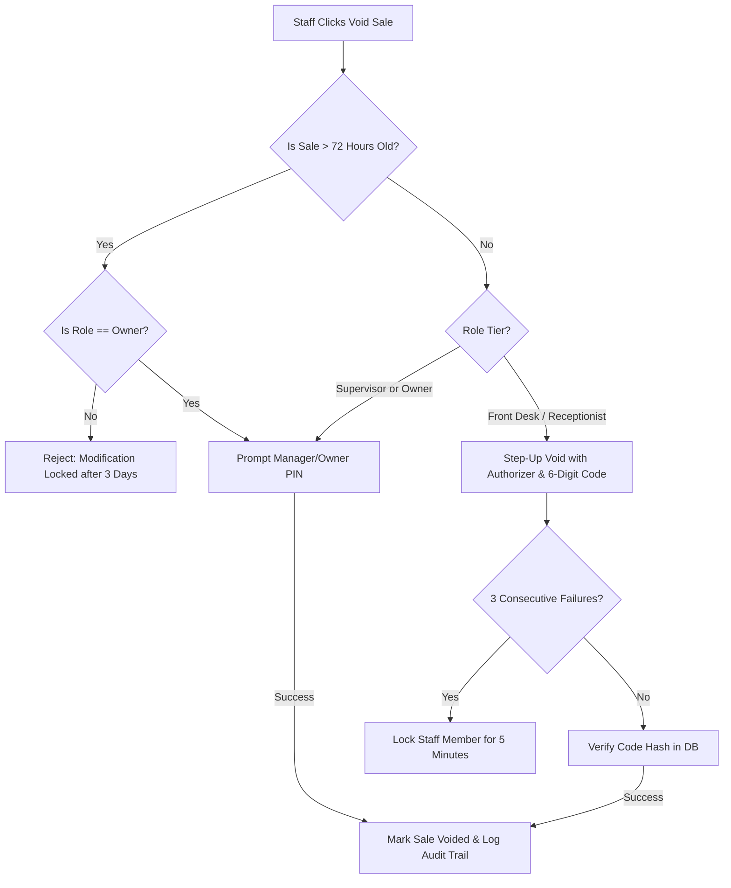

# NXS Spa Management System — Production System & Operations Documentation

> 💡 **Notion Import Ready**: This enterprise-grade documentation is formatted with Notion-compatible callout blocks (`> 💡`), structured data tables, bold parameter labels, and clean hierarchical section headings for seamless copy/paste or Markdown import into Notion workspace databases.

---

## 1. Executive Overview & System Architecture

### 1.1 Executive Summary
The **NXS Spa Management System** is a mission-critical, enterprise web portal and operational engine built specifically for NXS Spa, a premier male-only wellness facility in Cubao, Quezon City, Philippines. The platform governs real-time reception dispatching, therapist schedule optimization, physical locker and room capacity allocation, point-of-sale (POS) remittance, customer loyalty accounting, and role-based operational security.

```
┌────────────────────────────────────────────────────────────────────────┐
│                        NXS SPA MANAGEMENT SUITE                        │
├────────────────────────────┬───────────────────────────────────────────┤
│ Front Desk Web Console     │ Next.js 15 App Router (TypeScript)        │
│ Client Mobile Portal       │ Lightweight Mobile Web Surface (`/portal`)│
│ Core Database & RLS Engine │ Supabase PostgreSQL 17 (ap-southeast-1)   │
│ Production Infrastructure  │ Vercel Serverless + Vercel Cron Jobs      │
└────────────────────────────┴───────────────────────────────────────────┘
```

---

### 1.2 Technology Stack Architecture

| Layer | Technology | Specification / Configuration | Operational Purpose |
|---|---|---|---|
| **Frontend Framework** | Next.js 15 (App Router) | React Server Components (RSC), TypeScript strict mode, route proxies | Server-rendered high performance floor views and reactive transactional client components. |
| **Styling & Design System** | Tailwind CSS | Semantic tokens (`bg-surface`, `border-border`, `text-gold`, `text-foreground`, `text-muted`) | High-contrast, dark-mode optimized floor dashboard with full responsive light-mode parity. |
| **Database & Storage** | Supabase PostgreSQL 17 | Hosted in AWS `ap-southeast-1` (Singapore), Project: `zqwiqrvqyinacjozubtc` | Relational storage, GiST concurrency locks, trigger-level immutability, and storage buckets (`brand-assets`). |
| **Authentication & Access** | Supabase Auth (`@supabase/ssr`) | Cookie-based session validation, synthetic staff emails (`@staff.nxsspa.internal`) | Secure staff session persistence with zero-trust Row Level Security (RLS) enforcement. |
| **Hosting & Automation** | Vercel Serverless | Edge network deployment, `vercel.json` crons (`auto-cancel-bookings`, `keep-alive`) | 99.99% uptime serverless runtime, automated overnight rollover, and free-tier keepalive. |

---

### 1.3 Core Architecture Invariants (ADR-001)

The platform adheres to 11 locked architectural decisions documented in `ADR-001`. These guarantees are enforced directly in the database engine and must never be bypassed by application-level shortcuts.

> 💡 **Invariant 1: 8:00 AM Spa-Day Turnover Lock**
> The operational spa day does not turn over at calendar midnight (`00:00`). Operations running between `12:00 AM` and `07:59 AM PHT` belong authoritatively to the *previous* calendar date's Spa Day (`manilaDate - 24h`). The canonical operational turnover occurs at **8:00 AM Asia/Manila (UTC+8)**. All daily sales remittances, locker occupancy audits, and daily therapist capacities anchor to this turnover timestamp.

> 💡 **Invariant 2: Canonical 80-Minute Massage Standard & Prime Scrub Lock**
> The canonical duration for all core massage services (`Combi Massage`, `Signature Massage`, and default `services.duration_minutes`) is strictly **80 minutes**. Legacy 60-minute and 90-minute standards are permanently retired. `Prime Scrub Massage` (80 minutes, ₱1,800, 12 loyalty points, `requires_therapist = true`) is the sole source of truth for body scrub services; legacy catalog items (`Scrub`, `Scrub + Massage`) are permanently deactivated.

> 💡 **Invariant 3: Single Client Identity Invariant (Name / Codename)**
> To guarantee maximum guest privacy, `public.clients` contains **zero legal-name columns**. The guest's chosen alias (`codename`, labeled interchangeably as "Name" or "Codename" across interfaces) is the sole identity stored and displayed. No companion tagging or legal identity aggregation is permitted.

> 💡 **Invariant 4: Append-Only Immutable Points Ledger**
> `public.point_transactions` is an append-only accounting ledger. SQL `UPDATE` and `DELETE` operations are completely blocked by database triggers (`trg_block_ledger_update`, `trg_block_ledger_delete`). Balances are recalculated strictly via `INSERT` triggers (`trg_apply_points_delta`). Corrections must be recorded as distinct `ADJUSTMENT` entries with mandatory explanatory notes.

> 💡 **Invariant 5: Separation of Sales and Points Ledger**
> `public.sales` (mutable, POS remittance domain) and `public.point_transactions` (immutable, loyalty domain) are completely independent tables. They are cross-referenced solely via the nullable foreign key `point_transactions.sale_id`. Sales records can be edited or voided under audit PIN controls, but ledger entries remain forever immutable.

> 💡 **Invariant 6: Database-Enforced Concurrency (GiST Exclusion Constraints)**
> Double-booking prevention is enforced at the PostgreSQL engine level using Generalized Search Tree (GiST) temporal exclusion constraints (`no_double_book_therapist`, `no_double_book_room`). Room availability is decoupled from all-day locker stays.

> 💡 **Invariant 7: Zero-Trust Staff Auth & Identity-Keyed RLS**
> Every route requires an authenticated Supabase Auth session (`proxy.ts`). Every database table enforces RLS keyed off `auth.uid() → staff.user_id → staff.position`. No open `USING (true)` policies exist. Simulated roles are strictly prohibited.

---

## 2. Database Schema & Integrity Guarantees

### 2.1 Core Tables Breakdown



#### 1. `public.clients`
*Client and Member Identity Registry*
- **`id`** (`uuid`, Primary Key): Unique client identifier.
- **`codename`** (`text`, Not Null): Display name or privacy alias chosen by the client.
- **`username`** (`text`, Not Null, Unique): Portal username handle (`@username`).
- **`member_code`** (`text`, Not Null): Formatted membership code (e.g. `#M-00104`).
- **`points_balance`** (`integer`, Not Null, Default `0`): Authoritative cached points balance, maintained strictly by trigger.
- **`phone`** (`text`, Nullable): PII field. Masked by default in UI (showing only last 4 digits). Revealing full phone triggers a logged audit event (`phone_number_revealed`).
- **`qr_token`** (`text`, Nullable): Permanent verification token encoded into client mobile QR passbook.
- **`privacy_consent`** (`boolean`, Default `false`): Consent flag for communications.

#### 2. `public.bookings`
*Scheduling and Dispatch Engine*
- **`id`** (`uuid`, Primary Key): Booking identifier.
- **`client_id`** (`uuid`, Nullable, FK → `clients.id`): Linked member; null for non-member walk-ins.
- **`guest_label`** (`text`, Nullable): Guest name for walk-ins without an account. Check constraint ensures either `client_id` or `guest_label` is present.
- **`service_id`** (`uuid`, Not Null, FK → `services.id`): Booked service.
- **`therapist_id`** (`uuid`, Nullable, FK → `therapists.id`): Assigned practitioner; null for Wet Area facility visits.
- **`room_number`** (`integer`, Nullable, FK → `rooms.number`): Assigned massage room (1 to 18); null for Wet Area.
- **`booking_date`** (`date`, Not Null): Operational calendar date.
- **`start_time`** (`time`, Not Null): Scheduled start time (e.g. `16:30:00`, `20:00:00`).
- **`start_ts` / `end_ts`** (`timestamptz`, Computed): Automatically maintained by trigger `trg_bookings_set_computed_fields` as `start_ts = booking_date + start_time` and `end_ts = start_ts + duration_minutes`.
- **`duration_minutes`** (`integer`, Not Null): Service duration (standard 80 min).
- **`status`** (`enum`: `Booked`, `Completed`, `No-show`, `Cancelled`, `Needs Reassignment`): Booking lifecycle state.
- **`created_by`** (`uuid`, FK → `staff.id`): Staff member who created the booking.

#### 3. `public.locker_occupancy`
*Physical Facility Occupancy & Check-In Tracking*
- **`id`** (`uuid`, Primary Key): Occupancy record ID.
- **`locker_number`** (`integer`, Not Null, FK → `lockers.number`): Physical locker assigned.
- **`booking_id`** (`uuid`, Nullable, FK → `bookings.id`): Originating booking reference.
- **`client_id`** (`uuid`, Nullable, FK → `clients.id`): Member client reference.
- **`guest_label`** (`text`, Nullable): Free-text name for walk-in guests.
- **`room_number`** (`integer`, Nullable): Room assigned for initial massage.
- **`service_id`** (`uuid`, Nullable, FK → `services.id`): Primary service availed.
- **`checked_in_at`** (`timestamptz`, Default `now()`): Check-in timestamp.
- **`checked_in_by`** (`uuid`, FK → `staff.id`): Staff member processing check-in.
- **`checked_out_at`** (`timestamptz`, Nullable): Departure timestamp (`null` while active).
- **`checked_out_by`** (`uuid`, Nullable, FK → `staff.id`): Staff member completing check-out.

#### 4. `public.services`
*Service Catalog & Configuration*
- **`id`** (`uuid`, Primary Key): Service ID.
- **`name`** (`text`, Not Null): Service title (e.g. `Combi Massage`, `Signature Massage`, `Prime Scrub Massage`, `Wet Area`).
- **`price`** (`numeric`, Not Null): Standard retail price.
- **`duration_minutes`** (`integer`, Not Null, Default `80`): Service duration (80 min standard).
- **`points_earned`** (`integer`, Not Null): Base loyalty points awarded upon completion.
- **`requires_therapist`** (`boolean`, Not Null, Default `true`): Flag defining whether staff assignment is mandatory (`false` exclusively for `Wet Area`).
- **`active`** (`boolean`, Default `true`): Soft-delete indicator.

#### 5. `public.therapists` & Availability Roster
*Staff Roster & Scheduling Constraints*
- **`public.therapists`**: `id`, `name`, `archived` (`boolean`), `archived_at`, `archived_by`, `archived_reason`.
- **`public.therapist_day_off`**: Recurring weekly off-day (`weekday` 0 = Sun to 6 = Sat).
- **`public.therapist_absence`**: Specific calendar date absences (`absent_date`).
- **`public.therapist_leave`**: Date-range leaves (`start_date`, `end_date`).
- **`public.therapist_breaks`**: Scheduled time slot breaks (`break_date`, `slot_time`).
- **`public.therapist_services`**: Many-to-many mapping of services each therapist is qualified to perform.

#### 6. `public.sales` & `public.sale_addons`
*Point of Sale & Shift Remittance Records*
- **`public.sales`**:
  - `id` (`uuid`, PK), `client_id` (nullable FK), `guest_label` (nullable text), `service_id` (FK), `therapist_id` (nullable FK), `booking_id` (nullable FK), `promo_id` (nullable FK).
  - `amount` (`numeric`, Not Null): Net amount collected.
  - `payment_method` (`text`, Check `IN ('Cash', 'GCash', 'Card', 'Points')`): Method of payment.
  - `payment_ref` (`text`, Nullable): Reference code for electronic payments.
  - `manual_discount_type` (`pct` or `fixed`), `manual_discount_value` (`numeric`).
  - `processed_by` (`uuid`, FK → `staff.id`): Authenticated receptionist.
  - `edited_by` / `edited_at`: Audit columns for supervisor adjustments.
  - `voided` (`boolean`, Default `false`), `voided_at`, `voided_by`, `void_reason`: Strict void audit trail.
- **`public.sale_addons`**:
  - `id` (`uuid`, PK), `sale_id` (`uuid`, FK), `addon_id` (`uuid`, FK), `price_at_sale` (`numeric`). Snapshots addon pricing at time of sale.

#### 7. `public.point_transactions`
*Immutable Loyalty Points Accounting Ledger*
- **`id`** (`uuid`, PK): Transaction identifier.
- **`client_id`** (`uuid`, Not Null, FK → `clients.id`): Recipient member.
- **`points_delta`** (`integer`, Not Null): Points change (+5 for earn, -100 for redeem, +/- for adjustment).
- **`entry_type`** (`text`, Check `IN ('EARN', 'REDEEM', 'ADJUSTMENT')`): Transaction classification.
- **`source`** (`text`, Check `IN ('STAFF_MANUAL', 'QR_SCAN', 'ADJUSTMENT')`): Origination channel.
- **`booking_id`** (`uuid`, Nullable FK), **`sale_id`** (`uuid`, Nullable FK).
- **`processed_by`** (`uuid`, Not Null, FK → `staff.id`): Staff authorizer.
- **`idempotency_key`** (`text`, Nullable, Unique): Prevents duplicate transactions on network retry.
- **`notes`** (`text`, Nullable): Mandatory explanation when `entry_type = 'ADJUSTMENT'`.
- **`created_at`** (`timestamptz`, Default `now()`): Immutable creation timestamp.

#### 8. `public.commission_rates` & Dynamic Commission Reporting
*Therapist Earnings & Payout Computation*
- **`public.commission_rates`**:
  - `id` (`uuid`, PK), `service_id` (`uuid`, FK → `services.id`), `rate_type` (`text`, Check `IN ('percent', 'flat')`, Default `'percent'`), `percent` (`numeric`, Not Null): Value representing either percentage (e.g. 15%) or flat peso amount (e.g. ₱150).
  - `effective_from` (`timestamptz`), `effective_to` (`timestamptz`, Nullable), `is_active` (`boolean`).
  - Effective-dated append-only design: Updating a rate closes the active row (`effective_to = now()`, `is_active = false`) and inserts a new rate row.
- **Dynamic Payout Aggregation**:
  - Commission is calculated dynamically across `bookings` where `status IN ('Booked', 'Completed')` and `therapist_id IS NOT NULL` joined to active `services` where `requires_therapist = true`.
  - Rate lookup matches the booking date against the `effective_from` and `effective_to` window with automatic fallback to current rates.

---

### 2.2 PostgreSQL GiST Concurrency Locks

To prevent race conditions, physical room double-bookings, and simultaneous therapist scheduling, NXS enforces PostgreSQL **GiST (Generalized Search Tree)** exclusion constraints:

```sql
-- Therapist Concurrency Exclusion
ALTER TABLE public.bookings
ADD CONSTRAINT no_double_book_therapist
EXCLUDE USING gist (
    therapist_id WITH =,
    tsrange(start_ts, end_ts) WITH &&
)
WHERE (status IN ('Booked', 'Completed', 'Needs Reassignment'));

-- Room Concurrency Exclusion
ALTER TABLE public.bookings
ADD CONSTRAINT no_double_book_room
EXCLUDE USING gist (
    room_number WITH =,
    tsrange(start_ts, end_ts) WITH &&
)
WHERE (status IN ('Booked', 'Completed', 'Needs Reassignment'));
```

#### GiST Locking Behavior Rules:
1. **`tsrange(start_ts, end_ts)` Overlap**: If two transactions attempt to schedule the same therapist or room with overlapping timestamp ranges, PostgreSQL immediately aborts the conflicting transaction with error code `23P01` (`exclusion_violation`).
2. **`Completed` Booking Locking**: Completed bookings **continue to consume capacity** for their scheduled time window. This prevents staff from altering past historical appointments or causing retroactive room/therapist collisions.
3. **`No-show` and `Cancelled` Release**:
   - `Cancelled` bookings release therapist and room capacity immediately.
   - `No-show` bookings fall outside the constraint's `WHERE` predicate, immediately releasing the slot for floor reassignment.
4. **Locker Concurrency**: Physical locker occupancy is enforced via a partial unique index:
   ```sql
   CREATE UNIQUE INDEX one_active_occupant_per_locker
   ON public.locker_occupancy (locker_number)
   WHERE (checked_out_at IS NULL);
   ```
   Room occupancy is deliberately decoupled from locker stays (`one_active_occupant_per_room` was dropped) to permit guests to retain their locker all day while freeing massage rooms immediately after the 80-minute session concludes.

---

### 2.3 Row Level Security (RLS) & RBAC Hierarchy

Staff access control is governed by PostgreSQL Row Level Security (RLS) evaluated against `auth.uid()`. Role membership is resolved through four database security functions:

```sql
-- Returns current staff position ('Receptionist', 'Supervisor', 'Owner', 'Attendant')
public.current_staff_position() RETURNS staff_position;

-- Returns true for any authenticated staff member
public.is_staff() RETURNS boolean;

-- Returns true for Supervisor or Owner
public.is_supervisor_or_above() RETURNS boolean;

-- Returns true strictly for Owner
public.is_owner() RETURNS boolean;
```

#### RBAC Permissions Matrix

| Domain / Resource | Front Desk (Receptionist) | Supervisor | Owner | Enforcement Mechanism |
|---|---|---|---|---|
| **Bookings** (`create`, `update`, `cancel`) | Full Access | Full Access | Full Access | `is_staff()` on SELECT, INSERT, UPDATE |
| **Check-In / Locker Check-Out** | Full Access | Full Access | Full Access | `is_staff()` on `locker_occupancy` |
| **Sales Remittance (Create)** | Full Access | Full Access | Full Access | `is_staff()` on `sales` INSERT |
| **Sales Remittance (Edit)** | Read-Only | Full Access (< 3 days) | Full Access (Anytime) | `is_supervisor_or_above()` + `guardLapsedSale` |
| **Sales Void (Direct)** | ❌ Blocked | ✅ Allowed (< 3 days) | ✅ Allowed (Anytime) | Trigger `block_void_by_non_owner` + RLS |
| **Sales Void (Step-Up with PIN)** | ✅ Allowed with PIN | ✅ Allowed with PIN | ✅ Allowed with PIN | RPC `void_sale_with_code` (Rate limited) |
| **Void Auth Code Setup** | ❌ Blocked | ❌ Blocked | ✅ Full Access | RPC `set_void_auth_code` + `is_owner()` |
| **Catalog & Services (Add/Edit)** | Read-Only | Full Access | Full Access | `is_supervisor_or_above()` on catalog tables |
| **Promo Codes (Create/Modify)** | Read-Only | Read-Only | Full Access | `is_owner()` on `promos` INSERT/UPDATE |
| **Therapist Schedule / Day-Off** | Read-Only | Full Access | Full Access | `is_supervisor_or_above()` |
| **Activity Audit Logs (`/logs`)** | ❌ Blocked | ❌ Blocked | ✅ Full Access | `is_owner()` on `action_logs` SELECT |
| **Financial Analytics & Payouts** | ❌ Blocked | ❌ Blocked | ✅ Full Access | App UI Guard + `is_owner()` on `commission_rates` |

---

## 3. Operational Floor Logic & Shift Workflows

### 3.1 Operating Hours & The 8:00 AM Rollover

NXS operates on an evening/late-night schedule tailored to urban spa guests:
- **Doors Open**: 4:30 PM PHT
- **Last Call for Massages**: 1:00 AM PHT (+1 day)
- **Facility Turnover / Reset Cutoff**: 8:00 AM PHT

```
  PREVIOUS SPA DAY CONTINUES                     CURRENT SPA DAY ACTIVE
◄───────────────────────────────┼──────────────────────────────────────────────►
 12:00 AM Midnight    07:59 AM   │ 08:00 AM        04:30 PM         01:00 AM
 (Belongs to Yesterday's Shift)  │ TURNOVER        DOORS OPEN       LAST CALL
```

#### Canonical Rollover Formula (`lib/analytics/spa-day.ts`)
To prevent late-night sales (e.g. 12:30 AM) from splitting into the next calendar day, the operational day calculation shifts Philippine Standard Time (UTC+8) backwards:

```typescript
export function toSpaDay(date: Date | string): string {
  const d = typeof date === "string" ? new Date(date) : date;
  // Manila is UTC+8. Subtracting 8 hours shifts midnight-to-7:59 AM back to prior day.
  const shifted = new Date(d.getTime() - 8 * 60 * 60 * 1000);
  return shifted.toISOString().slice(0, 10);
}
```

- Any transaction between **08:00:00 AM** and **11:59:59 PM** belongs to the current calendar date.
- Any transaction between **12:00:00 AM** and **07:59:59 AM** is mapped authoritatively to the *previous* calendar date's Spa Day.

---

### 3.2 Wet Area Architecture Lock

Guests frequenting NXS for sauna, steam, and hydrotherapy access utilize the **Wet Area** facility service.

```
┌──────────────────────────────────────────────────────────┐
│                   WET AREA SERVICE FLOW                  │
├────────────────────────────┬─────────────────────────────┤
│ Service Flag               │ `requires_therapist = false`│
│ Therapist Assignment       │ Strictly `null` (Bypassed)  │
│ Room Assignment            │ Strictly `null` (Bypassed)  │
│ Availability Checks        │ Bypassed (Never conflicts)  │
│ Reassignment Alerts        │ Suppressed                  │
│ Physical Locker Allocation │ Fully Maintained (`#1–100`) │
└────────────────────────────┴─────────────────────────────┘
```

1. **Assignment Bypass**: Booking forms and Quick Walk-in modals automatically hide Therapist and Room selectors when Wet Area is selected.
2. **Alert Suppression**: Wet Area bookings never appear on the `<ReassignmentPanel />` and are exempt from therapist day-off, absence, or break validation.
3. **Locker Association**: Wet Area guests receive physical locker assignment in `public.locker_occupancy`, ensuring complete floor accountability.

---

### 3.3 Prime Scrub Massage Single Source of Truth

The catalog was officially unified under a single scrub standard:
- **Canonical Service**: `Prime Scrub Massage`
- **Duration**: Strictly **80 minutes**
- **Price**: **₱1,800.00**
- **Base Loyalty Points**: **12 points**
- **Therapist Required**: `true`
- **Legacy Records**: `Scrub` (₱900) and `Scrub + Massage` (₱1,800) are flagged `active = false`. All relational constraints (`bookings`, `sales`, `locker_occupancy`, `therapist_services`) bind strictly to `Prime Scrub Massage`.

---

### 3.4 Stale Locker Auto-Checkout & Maintenance Lifecycle

Physical lockers (`1 to 100`) have two operational states: Active Occupancy and Out of Order.



#### Maintenance Gating
Staff can flag a damaged locker as "Out of Order" with an optional defect note (`maintenance_note`).
- **Occupancy Guard**: If a locker has an active occupant (`checked_out_at IS NULL`), the system rejects maintenance flagging until the guest is checked out.
- **Selector Disabling**: Out-of-order lockers are automatically disabled across `QuickWalkinModal`, `BookingFormModal`, and `EditBookingModal` with status label: `Locker X — Out of Order (Note)`.

#### Stale Locker Turnover Logic (`auto_checkout_stale_lockers`)
If a receptionist fails to check out a guest before leaving:
1. Active occupancy records from a prior spa day (`toSpaDay(checked_in_at) !== spaDayNow()`) are highlighted in the UI with a dashed red border and a `"Since yesterday"` warning badge.
2. The database stored procedure `public.auto_checkout_stale_lockers()` automatically closes unclosed records checked in prior to yesterday's 8:00 AM turnover:
   ```sql
   v_cutoff_ts := ((v_date_ph - 1) + time '08:00:00') AT TIME ZONE 'Asia/Manila';
   UPDATE public.locker_occupancy
   SET checked_out_at = v_cutoff_ts, checked_out_by = v_system_staff_id
   WHERE checked_out_at IS NULL AND checked_in_at < v_cutoff_ts;
   ```
   This releases locked lockers back into the free capacity inventory without human intervention.

---

### 3.5 Background Automation & Cron Scheduling

Production automation is managed by Vercel Cron triggers defined in `vercel.json`:

```json
{
  "crons": [
    {
      "path": "/api/cron/auto-cancel-bookings",
      "schedule": "0 18 * * *"
    },
    {
      "path": "/api/keep-alive",
      "schedule": "0 0 * * *"
    }
  ]
}
```

1. **Auto-Cancel Lapsed Bookings (`/api/cron/auto-cancel-bookings`)**:
   - **Schedule**: `0 18 * * *` UTC (2:00 AM Asia/Manila).
   - **Procedure**: Calls `public.auto_cancel_lapsed_bookings()`.
   - **Logic**: Evaluates all advance bookings with status `Booked` or `Needs Reassignment` where `booking_date <= yesterday`. Lapsed bookings are automatically transitioned to `Cancelled`, freeing any reserved therapist or room capacity. Each cancellation is audited in `action_logs` under action `auto_cancel_lapsed_booking`.
2. **Supabase Keep-Alive (`/api/keep-alive`)**:
   - **Schedule**: `0 0 * * *` UTC (8:00 AM Asia/Manila).
   - **Logic**: Performs a lightweight head query against `addons` using `createClient()` to ensure the project remains active and avoids inactivity auto-pausing.
3. **Elevated Execution**: All cron route handlers utilize `createServiceClient()` (`SUPABASE_SERVICE_ROLE_KEY`), with database procedures declaring `SET search_path = 'public'` and revoking public execute privileges.

---

## 4. Security & Safeguards

### 4.1 In-Flight Idempotency & Double-Click Safeguards

To prevent duplicate charges, repeated bookings, or double point awards during network latency:

```
[User Clicks "Confirm"]
       │
       ▼
[Set isPending = true] ────► [Disable Button & Render Spinner]
       │
       ▼
[Generate UUID / Idempotency Key]
       │
       ▼
[Execute Atomic Server Action]
       │
       ▼
[Revalidate Path & Close Modal]
```

1. **Client-Side Lockout**: All primary transactional buttons (`Confirm Check-in`, `Finalize Booking`, `Void Sale`, `Mark Maintenance`) bind their disabled state to React `useTransition` / `isPending` state. Once clicked, buttons immediately enter a disabled state with visual loading spinners, preventing duplicate submissions.
2. **Database Idempotency**:
   - `point_transactions` enforces a unique constraint on `idempotency_key`.
   - `quick_walkin()` and `log_visit()` RPCs execute in single atomic PostgreSQL transactions. If any sub-operation fails (e.g. GiST room exclusion), the entire visit, sale, and locker assignment are rolled back simultaneously.

---

### 4.2 Void Authorization Codes & PIN Validation

Voiding or modifying POS transactions is protected by a multi-layered security protocol:



#### Security Rules:
1. **The 3-Day (72-Hour) Lapse Rule (`guardLapsedSale`)**:
   - Sales older than 72 hours (`Date.now() - createdAt > 3 days`) are locked against modification or voiding.
   - For non-Owner staff, the `Edit` and `Void` buttons are disabled with tooltip: `"Void locked after 3 days. Owner only"`.
   - Backend actions verify the caller's position via `auth.getUser()` → `staff.position` before executing.
2. **Direct vs Step-Up Void**:
   - **Direct Path (Supervisor / Owner)**: Can initiate void actions directly using their authenticated session and Master PIN.
   - **Step-Up Path (Front Desk)**: Requires selecting a Supervisor/Owner authorizer and entering the shared 6-digit authorization code. The transaction executes via `void_sale_with_code()` `SECURITY DEFINER` RPC.
3. **Rate Limiting & Lockout**:
   - Failed void code attempts are tracked in `public.sale_void_attempts` keyed by the initiating staff member.
   - **3 consecutive failed attempts trigger an automatic 5-minute lockout** (`locked_until`).
4. **Mandatory Standardized Reasons**: Free-text reasons are replaced with a standardized dropdown:
   - `Double booking / Duplicate entry`
   - `Client cancelled / No-show`
   - `Incorrect service / Amount encoded`
   - `Incorrect payment method`
   - `Test transaction`
   - `Other` (Mandates detailed secondary text explanation).

---

### 4.3 Trigger-Enforced Points Mutation Immutability

The integrity of customer loyalty balances is guaranteed at the PostgreSQL engine level:

```sql
-- Trigger 1 & 2: Complete Immutability
CREATE OR REPLACE FUNCTION public.block_ledger_mutation()
RETURNS trigger AS $$
BEGIN
    RAISE EXCEPTION 'Points ledger is append-only. UPDATE and DELETE operations are forbidden.';
END;
$$ LANGUAGE plpgsql;

CREATE TRIGGER trg_block_ledger_update
BEFORE UPDATE ON public.point_transactions
FOR EACH ROW EXECUTE FUNCTION public.block_ledger_mutation();

CREATE TRIGGER trg_block_ledger_delete
BEFORE DELETE ON public.point_transactions
FOR EACH ROW EXECUTE FUNCTION public.block_ledger_mutation();
```

- **Delta Synchronization**: Balance adjustments execute strictly via `trg_apply_points_delta` firing on `INSERT`.
- **Privilege Separation**: `apply_points_delta()` is declared `SECURITY DEFINER` with search path set to `public`. Public, anon, and authenticated execution is revoked — it runs strictly under trigger context to update `clients.points_balance`.
- **Portal Account Prerequisite**: Trigger `trg_require_portal_account_for_earn_redeem` rejects any `EARN` or `REDEEM` ledger insert if the client does not possess a verified `client_portal_accounts` record.

---

## 5. Reception & Floor SOP Reference

### 5.1 Member QR Scan vs. Quick Walk-In SOP

```
┌────────────────────────────────────────────────────────────────────────┐
│                        RECEPTION CHECK-IN MODES                        │
├───────────────────────────────────┬────────────────────────────────────┤
│ REGISTERED MEMBER (PASSBOOK)      │ QUICK WALK-IN GUEST (NO ACCOUNT)   │
├───────────────────────────────────┼────────────────────────────────────┤
│ 1. Click "Scan QR" or Search Name │ 1. Click "Quick Walk-in" button    │
│ 2. Scan Client In-App QR Token    │ 2. Enter Guest Codename / Alias    │
│ 3. System loads verified balance  │ 3. Select Service (Wet Area/Combi) │
│ 4. Points awarded automatically   │ 4. System assigns free room/thera  │
│ 5. Select Locker & Confirm        │ 5. Assign Locker & Collect Payment │
└───────────────────────────────────┴────────────────────────────────────┘
```

#### Procedure A: Registered Member Check-In
1. Ask the client to open their mobile passbook (`/portal`) and present their **Member QR**.
2. On the Bookings screen, click **Log Visit** (or press the QR icon).
3. Scan the QR code using the USB optical scanner or camera overlay. The system resolves the client's `codename`, `@username`, and current points balance in `O(1)` time.
4. Select the Availed Service. If the member holds `≥ 100 points`, the promo dropdown enables `Loyalty Reward: Redeem 100 pts`.
5. Select an available Locker (occupied and out-of-order lockers appear disabled).
6. Select Payment Method (`Cash`, `GCash`, or `Split (Cash + GCash)`).
7. Review the Pre-Confirmation Summary Dialog and click **Finalize Check-in**.

#### Procedure B: Quick Walk-in Guest (No Account)
1. Click the primary **Quick Walk-in** button at the top right of `/bookings`.
2. In the Client field, leave as `— Walk-in / No account —` and enter their chosen alias in `Client Name (walk-in / no account)`.
3. Select Service:
   - If **Wet Area**: Room, Therapist, and Schedule fields are automatically hidden.
   - If **Massage**: Select Therapist first. Available time slots dynamically un-grey. Select Time Slot and assign an available Room.
4. Select an available Locker from the dropdown.
5. Apply any authorized Promo Code or Manual Discount (percentage or fixed ₱).
6. Select Payment Method and enter payment reference if GCash.
7. Click **Confirm Quick Walk-in**. The system creates the booking, logs the sale, assigns locker occupancy, and prints the floor dispatch slip.

#### Procedure C: Claiming Past Walk-In Stays for Newly Registered Members
If a guest registers for a portal account after completing walk-in visits:
1. Navigate to `/clients` and open the member's profile drawer.
2. Click **Claim Past Walk-in Visit** (enabled when `allow_walkin_claims = true` in Settings).
3. Search unlinked walk-in stays by guest alias or date.
4. Click **Submit Claim**. The claim appears under the **Pending Claims** tab.
5. A Supervisor or Owner verifies the claim and clicks **Approve**. The system updates past booking, sales, and locker records to the member ID and inserts an `EARN` ledger entry for retroactively credited points.

---

### 5.2 Loyalty Points Accrual & Redemption Rules

| Service Availed | Retail Price | Base Points (Fixed) | Proportional Formula Calculation |
|---|---|---|---|
| **Wet Area** | ₱600.00 | **3 points** | Always fixed at 3 points (bypasses formula) |
| **Combi Massage** | ₱1,100.00 | **5 points** | `round(5 × (servicePaidAmount / 1,100))` |
| **Signature Massage** | ₱1,300.00 | **6 points** | `round(6 × (servicePaidAmount / 1,300))` |
| **Prime Scrub Massage** | ₱1,800.00 | **12 points** | `round(12 × (servicePaidAmount / 1,800))` |

#### 100-Point Redemption SOP:
- **Redemption Benchmark**: Exactly **100 points = 1 Free 80-minute Combination Massage** (₱1,100 value).
- **Eligibility**: The client must have a linked `client_portal_accounts` record and `points_balance >= 100`.
- **Execution**: Selecting `Loyalty Reward: Redeem 100 pts` in the Promo selector zeroes out the base service price (`₱0.00`). Add-ons remain payable.
- **Accounting**: The server action atomically inserts an immutable `REDEEM` entry (`points_delta = -100`) and records the sale with `payment_method = 'Points'`. In shift remittance tables, redeemed services render with a distinct gold `Redeem` badge.

---

### 5.3 Booking Status Transitions & Lapsed Booking Management

```
             ┌────────────────┐
             │     Booked     │◄───────────────────┐
             └───────┬────────┘                    │
                     │                             │ Reassign Therapist /
                     ├───────────────► Needs       │ Reschedule Slot
                     │ Therapist Off/  Reassignment│
                     │ Absent/Leave  └──────┬──────┘
                     │                      │
     ┌───────────────┼──────────────────────┼─────────────────┐
     │ Check-In      │ Mark No-Show         │ Cancel Booking  │ Past 2:00 AM Cron
     ▼               ▼                      ▼                 ▼
┌───────────┐  ┌───────────┐          ┌───────────┐     ┌───────────┐
│ Completed │  │  No-show  │          │ Cancelled │     │ Cancelled │
└───────────┘  └───────────┘          └───────────┘     │  (Auto)   │
                                                        └───────────┘
```

#### Status Transition Rules:
1. **`Booked` → `Completed`**: Client arrives and checks in via Log Visit. Consumes GiST capacity. Populates `locker_occupancy` and `sales`.
2. **`Booked` → `Needs Reassignment`**: Automatically triggered if an assigned therapist is marked absent, placed on leave, or assigned a recurring day-off. Prompts urgent floor resolution on the Bookings page `<ReassignmentPanel />`.
3. **`Needs Reassignment` → `Booked`**: Resolved when reception reassigns an available therapist or adjusts the start time.
4. **`Booked` / `Needs Reassignment` → `Cancelled`**: Reception cancels appointment. **Immediately frees therapist and room capacity**.
5. **`Booked` → `No-show`**: Client fails to arrive within 20 minutes of start time. Slot is released from GiST exclusion constraints, permitting walk-in assignment.
6. **Automated Lapsed Cancellation**: The overnight cron job `/api/cron/auto-cancel-bookings` sweeps unclosed advance bookings at 2:00 AM PHT and marks them `Cancelled`, preventing dead appointments from cluttering historical dispatch sheets.

---

## 6. Document Revision & Verification Record

| Version | Date | Target Scope | Authorizer / Lead | Verification Status |
|---|---|---|---|---|
| **v1.0** | 2026-08-27 | Initial Architecture Baseline (ADR-001 Invariants 1–6) | Core Engineering | ✅ Verified Live |
| **v1.8** | 2026-08-29 | Staff Auth Complete (6A–6C-6, Zero-Trust RLS Matrix) | SecOps / Architecture | ✅ Verified Live |
| **v2.0** | 2026-09-01 | Client Portal Launch, Immutable Ledger Safeguards | Product Team | ✅ Verified Live |
| **v2.2** | 2026-09-17 | 8:00 AM Spa Day Turnover, Locker Decoupling, Split Remittance | Floor Operations Lead | ✅ Verified Live |
| **v2.4** | 2026-09-24 | Notion Enterprise Documentation Suite (`ohm#9c2e4f1a`) | Lead Architect | ✅ Verified Clean |
